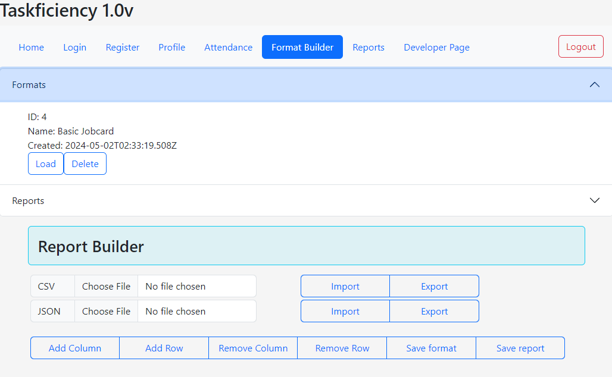
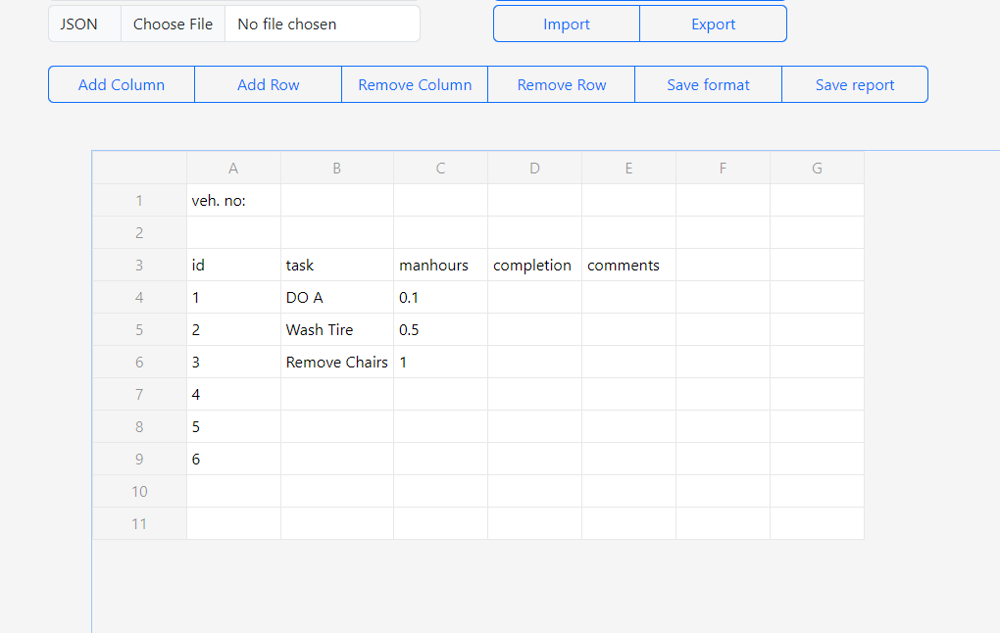

# Taskficiency (SEI-49 Capstone Project)

SEI-49 project 3 (PERN)

This app was created using PERN stack while using Sequelize for the ORM as both a learning experience as well as a request from a 'client'.

After some discussion, the app hopes to solve/alleviate several administrative duties to aid in handling their business and streamline it. Providing assistance through technology to track employee attendance, create reports as a format, allow employees to modify and create new reports based off a saved format for archiving and work progress tracking for the employer, etc.

The specific and summarized features can be found below.

## Features

- Track Employee attendance
- Create Excel-sheet styled report formats
- Reuse formats to generate new reports
- Import and export CSV and JSON to backup reports
- JWT-based Authentication
- Profile editing for employees to provide contact information

## Screenshots

The landing page and most important feature of any attendance app.

The second most important feature of the Taskficiency app, the report builder!

Editing of and filling in of saved report formats!

Quick overview and glance of employee's attendance today.

A detailed historical view of an employee's attendance.

## Technologies Used

- HTML
- CSS
- Javascript
- Bootstrap CSS/JS
- PapaParse
- React-Spreadsheet
- Sequelize
- Postgres
- Express
- React
- Node.js

## Environment Variables

To run this project, you will need to add the following environment variables to your .env file

[Frontend]

`VITE_SERVER`
`ACCESS_SECRET`
`REFRESH_SECRET`

[Backend]

`PORT`
`DATABASE`
`ACCESS_SECRET`
`REFRESH_SECRET`

## Learning Points

[Frontend]

- Fetch, useEffect, useState, useRef
- Component reuse
- API usage
- React lifecycle
- Importing & Exporting CSV, JSON
- PapaParse
- Using React-Spreadsheet to create a dynamic excel sheet-lookalike

[Backend]

- Sequelize
- Postgres
- Routers
- Controllers (Using Sequelize)
- Models (Using Sequelize)
- JWT
- bCrypt
- express-rate-limiter

## Ice Box

- Generate attendance report monthly
- Generate different types of attendance report
- Track employee working days and leaves balance
- Apply for leave status
- Export reports to excel formats (XLSX)
- Import excel sheet into custom report template
- Improve Frontend design
- Clock-in and out timer instead of tracking one datetime in and out
- OT hours timer instead of tracking one datetime in and out
- Profile viewing and editing from higher role employees/boss

## Known Bugs

- I'm praying there aren't any

## Authors

- [DamianChee](https://github.com/DamianChee/)

## Acknowledgements

- [Phind](https://www.phind.com/search?home=true)
- [React Spreadsheet](https://iddan.github.io/react-spreadsheet/)
- [Papa Parse](https://www.papaparse.com/)
- [Stackoverflow](https://stackoverflow.com/)
- [Awesome Readme Editor](https://readme.so/editor)
- [My very awesome understanding girlfriend]()
